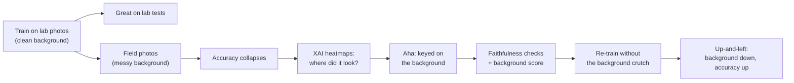

A friendly companion to [`bonus_rq.md`](bonus_rq.md). Same project, explained simply —
use it to brief a teammate or open the presentation. The formal RQ and hypotheses are
restated at the bottom for reference.

## The one-liner

> **A plant-disease AI looks like a great doctor in the lab, but flops in the real
> field — we use explainable AI to prove it's been cheating by looking at the
> background instead of the sick leaf, then fix it.**

## The story in 4 beats

**1. The setup.** We train an AI to spot plant diseases from leaf photos. The training
photos are all taken in a lab — clean, the same plain background every time. On lab
test photos it scores great.

**2. The problem.** Show it real photos from an actual farm (messy backgrounds, soil,
other plants) and its accuracy *collapses*. Same disease, same kind of leaf — but it
suddenly can't tell.

**3. The "aha."** Why? We use XAI (explainable-AI) heatmaps that highlight *where the
AI is looking*. It turns out that on the lab photos it was secretly keying on the
**background**, not the leaf. The lab background was always the same, so "background =
healthy/sick" was an easy shortcut. In the field, that shortcut breaks. We don't just
eyeball the heatmaps — we run sanity tests so we're sure the heatmap is telling the
truth, and we put a number on it: a **"background score"** = how much of the AI's
attention falls outside the leaf.

**4. The fix.** We retrain it while scrambling/removing the background so it *can't*
use that crutch. Result — the headline picture: the background score goes **down** and
field accuracy goes **up** at the same time. That proves the background shortcut was
the actual cause of the failure, not a coincidence.

## The arc at a glance

## Why it's a good XAI project

- It's not "here's a pretty heatmap" — it **uses XAI to diagnose a real bug and then
  fixes it**, with before/after evidence.
- Every claim is **checked** (faithfulness tests), so we can trust the explanations.
- The result is one clean, memorable figure: **shortcut down → accuracy up.**

## Cheat-sheet (jargon → plain words)

| Term in the proposal | What it really means |
|---|---|
| Vision Transformer (ViT) | The image-recognition AI model we use |
| In-distribution / lab (PlantVillage) | Clean lab photos — what it trains and tests on |
| Out-of-distribution / field (PlantDoc) | Messy real-farm photos — the hard test it never trained on |
| Shortcut / spurious correlation | The AI cheating by using the background |
| Post-hoc attribution (Rollout, Chefer, Grad-CAM, IG) | Heatmaps showing where the AI looked |
| Faithfulness (Deletion/Insertion, Adebayo) | Tests that the heatmap is honest, not made-up |
| Background-attribution score (BG-score) | A number for "how much it looked at the background" |
| De-biasing intervention | Retraining with the background removed/swapped so it can't cheat |
| The "up-and-left" figure | Headline result: background score ↓, field accuracy ↑ |

---

## Reference: the formal proposal in brief

**Research question.** Does background-shortcut learning, revealed by faithful
post-hoc attribution on a Vision Transformer, causally explain the lab→field accuracy
collapse of a plant-disease classifier — i.e., does a background-de-biasing
intervention simultaneously lower attribution to the background and recover
out-of-distribution accuracy?

**Hypotheses.**
- **H1** — lab-trained ViT drops sharply on field images.
- **H2** — XAI shows more background reliance on field-wrong cases (and survives
  faithfulness checks).
- **H3** — de-biasing moves the model up-and-left: lower background score **and**
  higher field accuracy.

**What we study.** ViT-Small, ImageNet-pretrained; PlantVillage (lab) for
train/in-distribution test, PlantDoc (field) as out-of-distribution test; four XAI
methods (Rollout, Chefer, Grad-CAM, Integrated Gradients); de-biasing applied at
fine-tune time so every run stays on the fast path.

**Deliverable.** A 5-slide presentation: the collapse, an attribution gallery, the
faithfulness-validated background score, and the causal up-and-left figure.

> Full version with feasibility notes and the fallback ladder: [`bonus_rq.md`](bonus_rq.md).
